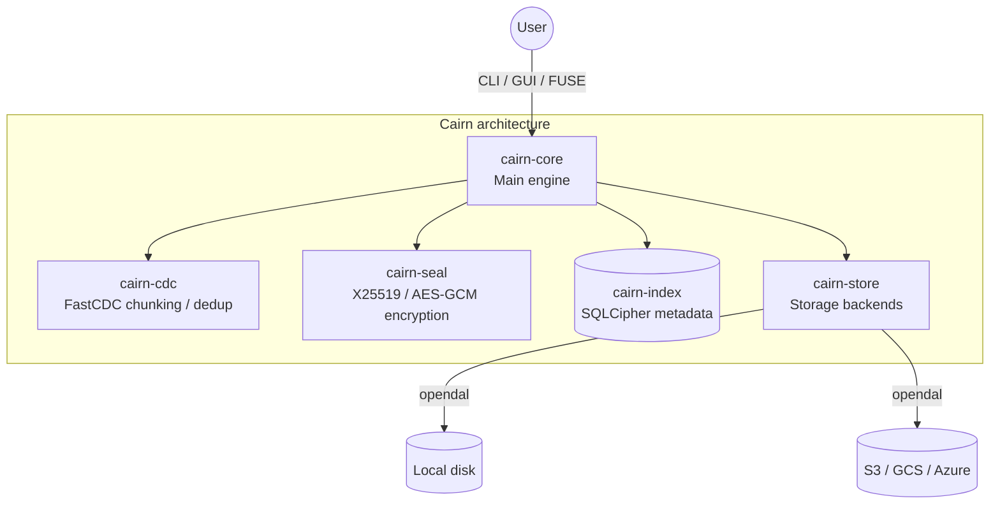

# Cairn — Encrypted, Deduplicated Backup Filesystem

> This is a Cargo **workspace** (monorepo); the product/binary is **`cairn`** and all logic lives in
> `crates/cairn-*`. The root `src/` is only the CLI.

Cairn is a cross-platform backup engine and FUSE filesystem for **reliable, encrypted, deduplicated backups**. It sets itself apart from restic/borg/kopia with two key properties (full comparison: [`COMPARISON.md`](COMPARISON.md)):

1. **Asymmetric (public/private-key) envelope encryption.** You back up with only a *public* key — which is safe to keep on any machine, server, or CI runner — and that machine can **never read the file *content* it backed up** (chunked *and* inline). Restoring content requires the *private* key, held only on a trusted machine. **Write-only means content-only:** the backup host still holds the DB *password* (required to write the index), so it can see **metadata** — names, sizes, tree, xattr values — but not content. *File names* are write-only too by default for asymmetric+password archives (keyed hashes + age-encrypted, readable only with the private key; sizes/tree/timestamps/xattrs still visible — pass `init --plaintext-names` to opt out — see [`HIDE_NAMES.md`](HIDE_NAMES.md)). See `THREAT_MODEL.md`. Pre-1.0: **no external cryptographic audit** yet (`COMPARISON.md`).
2. **Live Filesystem Mount.** Mount an encrypted, deduplicated backup as a normal read/write filesystem and browse/edit it in place, not just extract it. **Linux (fuse3) is the tested, supported target.** (A cross-platform `fuser` adapter existed earlier but has been removed; Windows/macOS support is a roadmap item, not a current feature.)

Under the hood: FastCDC content-defined chunking + dedup, zstd/lz4 compression, AES-256-GCM / ChaCha20-Poly1305 chunk encryption with per-chunk keys wrapped by an age X25519 recipient, a SQLCipher metadata index, and snapshots.



> **Storage: local disk or cloud, with multi-cloud RAID.** The default backend is your local disk. Cairn also supports S3, GCS, Azure Blob, and network drives, including RAID-0/1/5/6/10 across multiple cloud providers. Build with `--no-default-features` for an offline, local-only binary with no network stack.

## Quick Start (5 minutes)

```bash
# 1. Build
cargo build --release

# 2. Generate keys (on a trusted machine)
cargo run -p cairn-keys --bin gen_keys   # → priv.pem, pub.pem

# 3. Initialize an archive. The password and the key model are fixed HERE:
#    an archive initialized with --pub-key is asymmetric forever; one initialized
#    with only a password is symmetric forever (no key mixing later). No password
#    at init = the metadata index is stored UNENCRYPTED (cairn warns loudly).
cairn ~/mybackup.db init --password "a-strong-passphrase" --pub-key pub.pem

# 4. Back up a directory
cairn ~/mybackup.db backup /home/me/Documents /docs \
    --password "a-strong-passphrase" --pub-key pub.pem

# 5. Browse via FUSE mount (reading content needs the private key; a --pub-key-only
#    mount can list the tree but not read files — that is the write-only guarantee)
cairn ~/mybackup.db mount /mnt/cairn --password "a-strong-passphrase" --pub-key pub.pem --priv-key priv.pem
ls /mnt/cairn
fusermount -u /mnt/cairn

# 6. Restore files (no FUSE needed). On an asymmetric archive EVERY command
#    carries --pub-key (the pinned identity; the password alone cannot sidestep
#    the key gate) — reading additionally needs --priv-key.
cairn ~/mybackup.db restore /tmp/restored --password "a-strong-passphrase" --pub-key pub.pem --priv-key priv.pem

# 7. Check integrity (`check` and `verify` are synonyms; `scrub` also re-hashes chunks)
cairn ~/mybackup.db check --password "a-strong-passphrase" --pub-key pub.pem --priv-key priv.pem
```

**Symmetric mode** (simpler, no keypair needed — the password must be present at `init` too):
```bash
cairn simple.db init --password "a-strong-passphrase"
cairn simple.db backup /data /backup --password "a-strong-passphrase"
cairn simple.db mount /mnt/c --password "a-strong-passphrase"
```

## Installation

**Docker (Recommended for Server/CI):**
A fully static, zero-dependency Docker image (`scratch` based) is provided. Mount your local data directory using `-v` to perform backups.
```bash
docker build -t cairn .
docker run --rm -v /path/to/data:/data cairn /data/mybackup.db init --crypto-algo aes-256-gcm --comp-algo zstd --password "a-strong-passphrase" --pub-key /data/pub.pem
docker run --rm -v /path/to/data:/data cairn /data/mybackup.db backup /data/source /remote/dest --password "a-strong-passphrase" --pub-key /data/pub.pem
```

**Build from Source:**
```bash
cargo build --release
tests/e2e_smoke.sh target/release/cairn   # live FUSE smoke (Linux): mount, ls, extract, rollback, write-only guarantee
```

## Usage (Git-like CLI)

Generate a keypair once (ideally on a trusted machine). Keep `priv.pem` secret; `pub.pem` is safe to distribute:
```bash
cargo run -p cairn-keys --bin gen_keys   # writes priv.pem and pub.pem
```

**Losing `priv.pem` means losing every asymmetric backup — there is no recovery path, by design.** The
private key is the only thing that can decrypt. Guard it, and consider splitting it so no single lost or
stolen copy is fatal. `gen_keys` includes Shamir M-of-N secret sharing:
```bash
gen_keys split priv.pem 2 3     # 3 shares, any 2 reconstruct → share_1.bin share_2.bin share_3.bin
gen_keys combine priv.pem share_1.bin share_3.bin   # rebuild from any 2 (shares carry a threshold header,
                                                    # so combining too few fails loudly, never silently wrong)
```
Distribute the shares across separate custody (people/locations/safes). Losing the **`--password`** locks the
metadata index the same way. Neither the key nor the password can be reset — a backup tool cannot keep an escape
hatch that an attacker could also use.


**Initialize an archive:**
```bash
cairn mybackup.db init --pub-key pub.pem --crypto-algo aes-256-gcm --comp-algo zstd --index-sync-interval 300 --inline-max-size 4096
# (with CAIRN_PASSWORD exported; or pass --password)
```
*(Set `--index-sync-interval 0` to sync the index to the cloud synchronously on every snapshot instead of every N seconds. `--inline-max-size 4096` ensures files under 4KB are inlined natively within the SQLite DB to save S3 requests. Add `--disable-dedup` for maximum privacy: every chunk gets a fresh random key, identical content stops being correlatable — at the cost of deduplication; the mode is fixed at init.)*

**Configure Cloud RAID (optional):**
```bash
# Add providers (credentials are saved securely in the local index)
cairn mybackup.db raid add "s3://key:secret@s3.eu-central-1.amazonaws.com/hot-bucket"
cairn mybackup.db raid add "fs:///mnt/nas/cairn-chunks"
cairn mybackup.db raid set-mode raid1
```

**Back up (Direct Ingestion):**
Bypass FUSE and directly ingest files into the archive for maximum speed.
**Always copy the index** (map SPOF) off the backup host — never rebuild from chunks:
```bash
mkdir -p /offsite/index
cairn mybackup.db backup /home/vlad/Documents /remote/docs \
    --password "a-strong-passphrase" --pub-key pub.pem \
    --index-backup /offsite/index --auto-snapshot
# or: export CAIRN_INDEX_BACKUP=/offsite/index
# one-shot: cairn mybackup.db index-backup /offsite/index
# rotate a directory of copies (keep newest N; 0 = keep all):
#   --index-backup-keep N   (or CAIRN_INDEX_BACKUP_KEEP=N)
```

**Mount the Archive (Read/Write):** reading existing content requires the **private** key
(a `--pub-key`-only mount is *write-only* — you can list the tree and append, but not read
or edit what is already there; that is the whole point of the asymmetric mode).
```bash
cairn mybackup.db mount /mnt/cairn --password "a-strong-passphrase" --pub-key pub.pem --priv-key priv.pem
# Edit files inside /mnt/cairn, then unmount:
fusermount -u /mnt/cairn
```

**Symmetric (password-only) mode:**
Omit `--pub-key` entirely and Cairn runs without a keypair — one `--password` unlocks both the metadata index and
the data. Chunk keys are wrapped with a random per-archive key (KEK); the KEK itself is passphrase-wrapped once
(scrypt) and stored in the archive, so mounting costs one scrypt and a wrong password fails immediately:
```bash
cairn simple.db init --password "one-password"
cairn simple.db mount /mnt/cairn --password "one-password"
```
Trade-off vs the asymmetric default: there is **no write-only property** — any host that can back up can also read.

**Password & safety rules (`init`):**
- A password is **required** at `init` (min 8 chars). To create an archive with an
  UNENCRYPTED metadata index anyway, pass `--allow-plaintext-index` (names/sizes/tree
  become readable by stock `sqlite3`). For a throwaway short password, pass
  `--allow-weak-password`.
- **`init --force`** re-initializes (DESTROYS) an existing archive. On an
  **asymmetric** archive it now requires the master key (`--priv-key`) — a
  public-key-only host cannot wipe history, same rule as `gc`/`snapshot rm`. An
  append-only archive refuses `--force` outright.
- **`verify`** flags a file whose backup was interrupted (killed mid-write) as NOT
  restorable — re-run `backup` to complete it. **`scrub`** exits non-zero when it
  finds any corrupted/missing chunk.

**Extract Data:**
You can extract the entire archive, a single file, or files matching a wildcard pattern without mounting.
Pass `--preserve` to restore owner (uid/gid), timestamps (mtime), and xattrs in addition to data
and permissions (needs root for chown/trusted.* xattrs; without it, files are owned by the
extracting user):
```bash
cairn mybackup.db extract /tmp/restore_dir --preserve                      # Extract all, full fidelity
cairn mybackup.db extract /tmp/restore_dir --file-path "/home/vlad/doc.txt" # Single file (literal path)
cairn mybackup.db extract /tmp/restore_dir --glob "/home/vlad/*.txt"        # Wildcard matching (--file-path is always literal)
```

**Snapshots (Time Machine) & GFS Retention:**
```bash
cairn mybackup.db snapshot create "Before system update"
cairn mybackup.db snapshot ls
cairn mybackup.db snapshot prune --keep-daily 7 --keep-weekly 4 --keep-monthly 12
cairn mybackup.db snapshot rollback 3 --i-accept-non-atomic
# DANGEROUS: replaces the DB file (documented non-atomic crash window). Never on the sole copy;
# copies archive.db.pre-rollback.bak first. Chunk data is untouched — run before `gc` if needed.
cairn mybackup.db gc --grace-period-hours 24
```

**Append-only & the two-key model (ransomware hardening):**
On an asymmetric archive this is not a mode — it is the key model. The **public key can only add**; the
**private (master) key can do everything**:
- `gc`, `snapshot rm` and `snapshot prune` require `--priv-key` (possession is proven by deriving the public key
  from it and matching the archive's pinned recipient). A backup host that holds only `pub.pem` physically cannot
  destroy history through Cairn — no flag to set, nothing to configure.
- The archive **pins its recipient on first use**: a different `--pub-key` is refused (no key mixing), and running
  it without `--pub-key` at all is refused too (the password alone cannot sidestep the key gate).
- The background GC only runs in mounts that hold the master key.
- `snapshot rollback` stays available because it first auto-snapshots the current state (nothing is destroyed;
  you can always roll forward again).

For **symmetric archives** (single secret — no second key to gate on) there is an explicit one-way flag instead,
which also works on asymmetric archives as an extra ratchet (then even the master key holder is refused):
```bash
cairn mybackup.db init --append-only        # at creation, or later:
cairn mybackup.db append-only               # no CLI command can undo this
```

*Honest limits:* both are **client-side** enforcement — an attacker with the DB password and a SQLite shell can edit
the config; raw storage credentials can still delete objects. **Ransomware resistance requires server-side
immutability** (S3 Object Lock / GCS retention / WORM volume) as a hard prerequisite for that claim — not an
optional footnote. Cairn's chunks are content-addressed and write-once, so object-lock buckets work without special
support.

**Push / Pull / Daemon:**
```bash
cairn mybackup.db push          # Force upload the index and pending chunks to cloud
cairn mybackup.db daemon start  # Start the background GC and upload loops
```

## Core Technologies
- **Asymmetric envelope encryption**: each chunk is encrypted with a per-chunk symmetric key; that key is wrapped by an age X25519 recipient (`--pub-key`). Reading requires the X25519 private key (`--priv-key`), which is held behind `secrecy` in memory and zeroized on unmount.
- **FastCDC deduplication**: content-defined chunking with keyed BLAKE3 convergence (secure 256-bit salt auto-generated at init and stored in the encrypted config — there is no flag to supply it). Opt out with `init --disable-dedup` (random per-chunk keys: nothing correlates, nothing dedups).
- **Compression**: zstd / lz4 per chunk.
- **Metadata index**: SQLCipher (`--password`), with Git-like snapshots. The index itself is deduplicated via FastCDC before being synced to cloud storage to eliminate sync bloat.
- **Storage**: local disk (default) plus S3/GCS/Azblob via Apache OpenDAL, with RAID-0/1/5/6/10 across buckets.
- **Crash consistency**: chunks are immutable & content-addressed; the SQLCipher index is WAL-mode (all-or-nothing commits). A kill-9 or disk-full loses at most the last un-`fsync`'d write, never a corrupt file; interrupted backups resume via dedup. Details: `ARCHITECTURE.md` → *Crash & failure consistency*.
- **Platform**: Linux (fuse3) — tested and supported. Windows/macOS are roadmap items (the earlier cross-platform adapter was removed from the tree).

## Memory tuning (global flags)

All limits have safe defaults; raise them on big-RAM machines for faster bulk writes, lower them on constrained ones.

| Flag | Default | What it bounds |
|---|---|---|
| `--write-buffer-inode-mb` | 16 | Per-open-file write buffer; the buffer is flushed to chunks once it exceeds this. |
| `--write-buffer-global-mb` | 128 | Total write buffers across all open files. A writer that sees the budget exceeded flushes its own buffer synchronously (backpressure), so RAM stays bounded no matter how many files are being written. |
| `--chunk-cache-mb` | 32 | Decrypted chunk read cache (LRU by bytes). |
| `--sym-key-cache-cap` | 16384 | Unwrapped per-chunk key cache, in entries (~64 B each); prevents unbounded growth on terabyte-scale restores. |
| `--max-write-kb` | 1024 | Maximum FUSE read/write payload size, KiB (64..=8192). Also bounds the worst-case RAM allocation in `read` (`CAIRN_MAX_WRITE_KB`). |
| `--db-pool-size` | 16 | SQLCipher/SQLite connection-pool size. Each connection reserves its own page cache (`--db-cache-kb`), so worst-case resident memory is roughly `--db-pool-size` × `--db-cache-kb`. Lower either on constrained hosts (`CAIRN_DB_POOL_SIZE`). |
| `--db-cache-kb` | 64000 | Per-connection SQLite page cache, KiB. Larger = faster repeated reads, more RAM (`CAIRN_DB_CACHE_KB`). |
| `--db-synchronous` | FULL | SQLite `synchronous` PRAGMA. `FULL` (default; safest against power loss on filesystems that reorder WAL writes — the right choice for irreplaceable backup metadata) or `NORMAL` (faster, still crash-safe under WAL but weaker against power loss). One of OFF, NORMAL, FULL, EXTRA (`CAIRN_DB_SYNCHRONOUS`). |
| `--db-mmap-kb` | 32768 | SQLite mmap size in KiB per connection (32 MiB default). Higher = more memory-mapped I/O (`CAIRN_DB_MMAP_KB`). |
| `--db-busy-timeout-ms` | 15000 | SQLite BUSY wait timeout in milliseconds (`CAIRN_DB_BUSY_TIMEOUT_MS`). |
| `--db-connection-timeout-secs` | 30 | Connection-pool acquire timeout in seconds (`CAIRN_DB_CONNECTION_TIMEOUT_SECS`). |
| `--max-file-size-gib` | 1024 | Maximum single-file size in GiB. Files larger than this are rejected with EFBIG (`CAIRN_MAX_FILE_SIZE_GIB`). |
| `--password-file` | — | Read the symmetric password from a file (one line, trimmed). More secure than `--password` (file permissions control access). |

## Other global flags

| Flag / command | What it does |
|---|---|
| `init --force` | Overwrites an existing DB (DESTRUCTIVE: wipes all files, snapshots and cached chunks). |
| `init --disable-dedup` | Random per-chunk keys — maximum privacy, no deduplication. Fixed at init. |
| `init --plaintext-names` | Opt out of the default name-hiding on asymmetric+password archives (keeps real names visible to anyone with the password, like a symmetric archive). Fixed at init. See [`HIDE_NAMES.md`](HIDE_NAMES.md). |
| `extract --glob 'pattern'` | Extracts only matching paths (mutually exclusive with the literal `--file-path`). |
| `backup --exclude 'pattern'` | Excludes matching files from backup. Pattern is validated at startup. |
| `snapshot prune --keep-daily N` | GFS retention (with `--keep-weekly/--keep-monthly/--keep-yearly`). `0` = rule not applied. |
| `restore <dest>` | Restores files without FUSE. Supports `--file-path`, `--glob`, `--preserve`, `--to-source`. |
| `check` / `verify` | **Synonyms** — restorability of *indexed* files (decrypt end-to-end). Not a whole-archive inventory MAC. `--force-remote` bypasses local cache (offsite proof). `--expect-min-files N` ops completeness check. |
| `snapshot rollback` | Requires `--i-accept-non-atomic`; writes `.pre-rollback.bak` before swap. |
